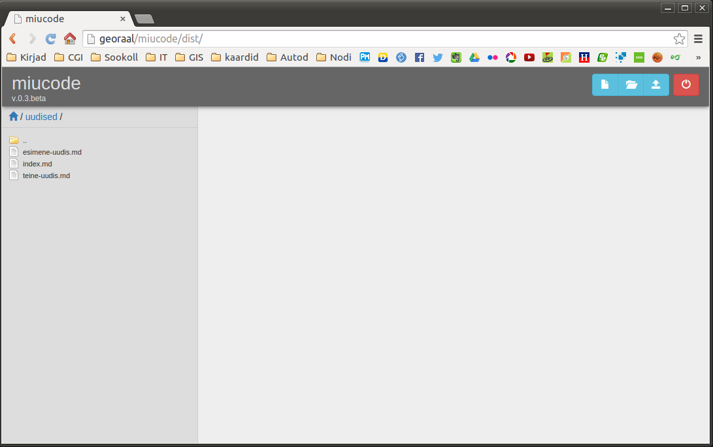
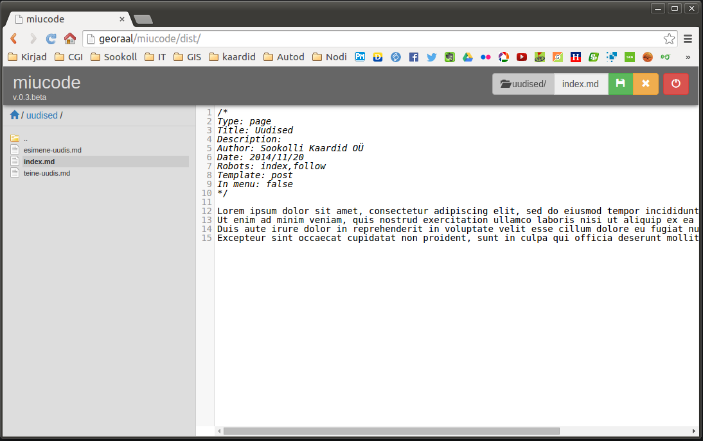

miucode-0.2.beta
================

It is successor of:  
[https://github.com/sookoll/miucode-0.2.beta](https://github.com/sookoll/miucode-0.2.beta)

* Miucode - Simple text editor in your browser
* Current version: 0.3 Beta
* Release date: 01.12.2014.
* Author: Mihkel Oviir
* License: Released under MIT. Look for LICENSE in program folder
 
## Usage

1. Download packed .zip
2. Unpack it.
3. Upload content to web server using ftp client or similar
4. Edit config.ini file to suit your needs
5. Happy scripting in your browser!

## Components

1. jQuery Explorer [https://github.com/sookoll/jquery-explorer](https://github.com/sookoll/jquery-explorer)
2. Codemirror [http://codemirror.net/](http://codemirror.net/)
3. Bootstrap [http://getbootstrap.com/](http://getbootstrap.com/)
4. jQuery file Upload [https://blueimp.github.io/jQuery-File-Upload/](https://blueimp.github.io/jQuery-File-Upload/)
5. RequireJS [http://requirejs.org/](http://requirejs.org/)

## Build project

1. Copy all third party libraries from vendor to src/ui/libs/
2. To keep build as minimal as it can, copy only needed files!
3. To run r optimizer:

    $ node tools/r.js -o tools/build.js
    
4. Build will create dist folder with optimized application.

## Screenshots

